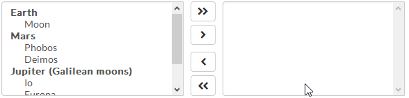

# react-dual-listbox

[](https://www.npmjs.com/package/react-dual-listbox)
[](https://github.com/jakezatecky/react-dual-listbox/actions/workflows/main.yml)
[](https://raw.githubusercontent.com/jakezatecky/react-dual-listbox/master/LICENSE.txt)

> A feature-rich dual listbox for React.



## Usage

### Installation

Install the library using your favorite dependency manager:

``` shell
yarn add react-dual-listbox
```

Using npm:

``` shell
npm install react-dual-listbox --save
```

> **Note** &ndash; This library makes use of [Font Awesome][font-awesome] styles and expects them to be loaded in the browser.

### Include CSS

The library's styles are available through one of the following files:

* `node_modules/react-dual-listbox/lib/react-dual-listbox.css`
* `node_modules/react-dual-listbox/src/scss/react-dual-listbox.scss`

Either include one of these files in your stylesheets or utilize a CSS loader:

``` jsx
import 'react-dual-listbox/lib/react-dual-listbox.css';
```

### Render Component

The `DualListBox` is a [controlled][react-controlled] component, so you have to update the `selected` property in conjunction with the `onChange` handler if you want the selected values to change.

Here is a minimal rendering of the component:

``` jsx
import React, { useState } from 'react';
import DualListBox from 'react-dual-listbox';
import 'react-dual-listbox/lib/react-dual-listbox.css';

const options = [
    { value: 'one', label: 'Option One' },
    { value: 'two', label: 'Option Two' },
];

function Widget() {
    const [selected, setSelected] = useState([]);

    return (
        <DualListBox
            options={options}
            selected={selected}
            onChange={(value) => setSelected(value)}
        />
    );
}
```

### Optgroups

Traditional `<optgroup>`'s are also supported:

``` jsx
const options = [
    {
        label: 'Earth',
        options: [
            { value: 'luna', label: 'Moon' },
        ],
    },
    {
        label: 'Mars',
        options: [
            { value: 'phobos', label: 'Phobos' },
            { value: 'deimos', label: 'Deimos' },
        ],
    },
    {
        label: 'Jupiter',
        options: [
            { value: 'io', label: 'Io' },
            { value: 'europa', label: 'Europa' },
            { value: 'ganymede', label: 'Ganymede' },
            { value: 'callisto', label: 'Callisto' },
        ],
    },
];

return <DualListBox options={options} />;
```

### Disabling the Component or Options

Pass in the `disabled` property to disable the entire component. Alternatively, individual options may be disabled on a per-item basis:

``` jsx
const options = [
    {
        label: 'Mars',
        disabled: true,
        options: [
            { value: 'phobos', label: 'Phobos' },
            { value: 'deimos', label: 'Deimos' },
        ],
    },
    {
        label: 'Jupiter',
        options: [
            { value: 'io', label: 'Io' },
            { value: 'europa', label: 'Europa', disabled: true },
            { value: 'ganymede', label: 'Ganymede' },
            { value: 'callisto', label: 'Callisto' },
        ],
    },
];

return <DualListBox options={options} />;
```

### Filtering

You can enable filtering of available and selected options by merely passing in the `canFilter` property:

``` jsx
<DualListBox canFilter options={options} />
```

Optionally, you can also override the default filter placeholder text and the filtering function:

``` jsx
<DualListBox
    canFilter
    filterCallback={(option, filterInput, { getOptionLabel }) => {
        if (filterInput === '') {
            return true;
        }

        return (new RegExp(filterInput, 'i')).test(getOptionLabel(option));
    }}
    options={options}
/>
```

In addition, you can control the filter search text, rather than leaving it up to the component:

``` jsx
<DualListBox
    canFilter
    filter={{
        available: 'europa',
        selected: '',
    }}
    options={options}
    onFilterChange={(filter) => {
        console.log(filter;
    }}
/>
```

### Action/Button Alignment

By default, the component arranges movement buttons to the center. Another option is to align these actions to be above their respective lists:

``` jsx
<DualListBox alignActions="top" options={options} />
```

### Preserve Select Ordering

By default, `react-dual-listbox` will order any selected items according to the order of the `options` property. There may be times in which you wish to preserve the selection order instead. In this case, you can add the `preserveSelectOrder` property.

> **Note** &ndash; Any `<optgroup>`'s supplied will not be surfaced when preserving the selection order.

``` jsx
<DualListBox options={options} preserveSelectOrder />
```

To allow users to re-arrange their selections after moving items to the right, you may also pass in the `showOrderButtons` property.

### Restrict Available Options

Sometimes, it may be desirable to restrict what options are available for selection. For example, you may have a control above the dual listbox that allows a user to search for a planet in the solar system. After selecting a planet, you restrict the available options to the moons of that planet. Use the `available` property in that case.

``` jsx
// Let's restrict ourselves to the Jovian moons
const available = ['io', 'europa', 'ganymede', 'callisto'];

return <DualListBox options={options} available={available} />;
```

### Changing the Default Icons

By default, **react-dual-listbox** uses [Font Awesome][font-awesome] for the various icons that appear in the component. To change the defaults, simply pass in the `icons` property to override the defaults:

``` jsx
<DualListBox
    ...
    icons={{
        moveLeft: <span className="fa fa-chevron-left" />,
        moveAllLeft: [
            <span key={0} className="fa fa-chevron-left" />,
            <span key={1} className="fa fa-chevron-left" />,
        ],
        moveRight: <span className="fa fa-chevron-right" />,
        moveAllRight: [
            <span key={0} className="fa fa-chevron-right" />,
            <span key={1} className="fa fa-chevron-right" />,
        ],
        moveDown: <span className="fa fa-chevron-down" />,
        moveUp: <span className="fa fa-chevron-up" />,
        moveTop: <span className="fa fa-double-angle-up" />,
        moveBottom: <span className="fa fa-double-angle-down" />,
    }}
/>
```

Alternatively, set the `iconsClass` property and define the icons in CSS.

### Additional `onChange` Details

At times, it may be useful to know which options the user highlighted before triggering a change or which control group was responsible for the change. In these cases, you can pass additional parameters to the `onChange` function:

``` jsx
const onChange = (selected, selection, controlKey) => {
    console.log('The user highlighted these options', selection);
    console.log('The following control triggered these changes', controlKey);
};
```

### All Properties

| Property              | Type     | Description                                                                                                             | Default          |
| --------------------- | -------- | ----------------------------------------------------------------------------------------------------------------------- | ---------------- |
| `options`             | array    | **Required**. Specifies the list of options that may exist on either side of the dual list box.                         |                  |
| `onChange`            | function | **Required**. The handler called when the selected options change: `function(selected, selection, controlKey) {}`.      |                  |
| `alignActions`        | string   | A value specifying whether to align the action buttons to the `'top'` or `'middle'`.                                    | `middle`         |
| `allowDuplicates`     | bool     | If true, duplicate options will be allowed in the selected list box.                                                    | `false`          |
| `available`           | array    | A subset of the `options` array to optionally filter the available list box.                                            | `undefined`      |
| `availableRef`        | function | A React function [ref][react-ref] to the "available" list box.                                                          | `null`           |
| `canFilter`           | bool     | If true, search boxes will appear above both list boxes, allowing the user to filter the results.                       | `false`          |
| `className`           | string   | An optional `className` to apply to the root node.                                                                      | `null`           |
| `disabled`            | bool     | If true, both "available" and "selected" list boxes will be disabled.                                                   | `false`          |
| `filter`              | object   | A key-value map of `{ available: [value], selected: [value] }` to control the filter values (defaults to uncontrolled). | `null`           |
| `filterCallback`      | function | The filter function to run on a given option and input string: `function(option, filterInput) {}`. See **Filtering**.   | `() => { ... }`  |
| `getOptionLabel`      | function | The function to resolve the **label** from an option. Defaults to `option => option.label`.                             | `() => { ... }`  |
| `getOptionValue`      | function | The function to resolve the **value** from an option. Defaults to `option => option.value`.                             | `() => { ... }`  |
| `htmlDir`             | string   | The [directionality][mdn-directionality] of the component's elements. Set to `'rtl'` if using a right-to-left language. | `'ltr'`          |
| `icons`               | object   | A key-value pairing of action icons and their React nodes. See **Changing the Default Icons** for further info.         | `{ ... }`        |
| `iconsClass`          | string   | A value specifying which overarching icon class to use. Built-in support for `fa5`, `fa6`, and `native` icons.          | `'fa6'`          |
| `id`                  | string   | An HTML ID prefix for the various sub elements.                                                                         | `null`           |
| `lang`                | object   | A key-value pairing of localized text. See [`src/js/lang/default.js`][lang-file] for a list of keys.                    | `{ ... }`        |
| `moveKeys`            | array    | A list of [keyboard keys][mdn-key] that will trigger a toggle of the highlighted options.                               | `[' ', 'Enter']` |
| `name`                | string   | A value for the `name` attribute on the hidden `<input />` element. This is potentially useful for form submissions.    | `null`           |
| `onFilterChange`      | function | A handler called when a filter input changes. Paired with `filter` when wanting to control the filter values.           | `null`           |
| `preserveSelectOrder` | bool     | If true, the order in which the available options are selected are preserved when the items are moved to the right.     | `false`          |
| `required`            | bool     | If true, this component will require `selected` to be non-empty to pass a form validation                               | `false`          |
| `selected`            | array    | A list of the selected options appearing in the rightmost list box.                                                     | `[]`             |
| `selectedRef`         | function | A React function [ref][react-ref] to the "selected" list box.                                                           | `null`           |
| `showHeaderLabels`    | bool     | If true, labels above both the available and selected list boxes will appear. These labels derive from `lang`.          | `false`          |
| `showNoOptionsText`   | bool     | If true, text will appear in place of the available/selected list boxes when no options are present.                    | `false`          |
| `showOrderButtons`    | bool     | If true, a set of up/down buttons will appear near the selected list box to allow the user to re-arrange the items.     | `false`          |
| `simpleValue`         | bool     | If true, the `selected` value passed in `onChange` is an array of string values. Otherwise, it is an array of options.  | `true`           |

#### Option Properties

| Property   | Type   | Description                                                                                                |
| ---------- | ------ | ---------------------------------------------------------------------------------------------------------- |
| `label`    | string | **Required**. The text label for the given option. Use `getOptionLabel` to set a different key.            |
| `value`    | mixed  | **Required**. The text or numeric value for the given option. Use `getOptionValue` to set a different key. |
| `disabled` | bool   | If true, disables the option from selection.                                                               |
| `title`    | string | Adds the HTML `title` attribute to the option.                                                             |

[react-controlled]: https://react.dev/learn/sharing-state-between-components#controlled-and-uncontrolled-components
[react-ref]: https://react.dev/learn/manipulating-the-dom-with-refs
[font-awesome]: https://fontawesome.com
[lang-file]: https://github.com/jakezatecky/react-dual-listbox/blob/master/src/js/lang/default.js
[mdn-directionality]: https://developer.mozilla.org/en-US/docs/Web/HTML/Global_attributes/dir
[mdn-key]: https://developer.mozilla.org/en-US/docs/Web/API/KeyboardEvent/key
